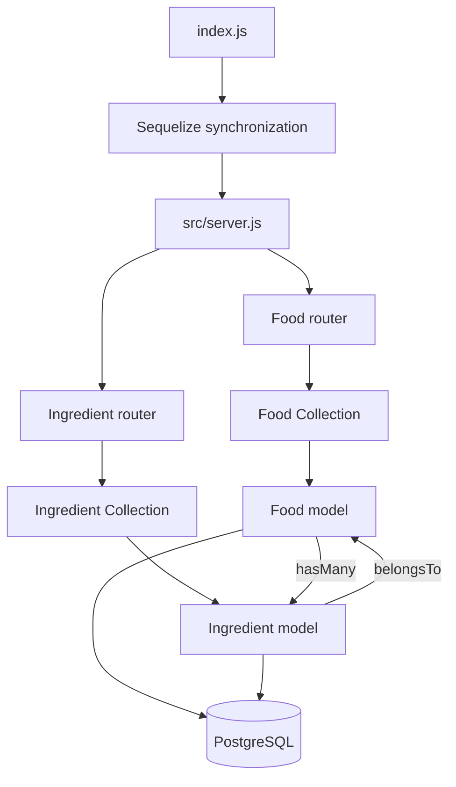

# api_Server

CRUD operations on a DB

## Links

- [Deployed API](https://api-server-163v.onrender.com/)
- [GitHub Actions](https://github.com/tonch-LIV/api_Server/actions)
- [Pull request](https://github.com/tonch-LIV/api_Server/pull/1)
- [Lab 04 pull request](hhttps://github.com/tonch-LIV/api_Server/pull/3)

## REST API

### Food

| Method | Route | Operation |
| --- | --- | --- |
| POST | `/food` | Create food |
| GET | `/food` | Read all food |
| GET | `/food/:id` | Read one food |
| GET | `/food/:id/ingredients` | Read food with its related ingredients |
| PUT | `/food/:id` | Update food |
| DELETE | `/food/:id` | Delete food |

Example:

```json
{
  "name": "apple",
  "calories": 95,
  "type": "fruit"
}
```

### Ingredients

| Method | Route | Operation |
| --- | --- | --- |
| POST | `/ingredients` | Create an ingredient |
| GET | `/ingredients` | Read all ingredients |
| GET | `/ingredients/:id` | Read one ingredient |
| PUT | `/ingredients/:id` | Update an ingredient |
| DELETE | `/ingredients/:id` | Delete an ingredient |

Example:

```json
{
  "name": "cheese",
  "amount": "2 cups",
  "foodId": "2"
}
```

Each Ingredient belongs to the Good Idnetified by `foodId`.

## Architecture



The reusable Collection class provides `create()`, `read()`, `update()`, and `delete()` methods for any supplied Sequelize model.

Food and Ingredient have a one-to-many relationship. A Food can have many Ingredients, while each Ingredient belongs to one Food through `foodId`.

Food responses provide a link to the nested association route, and Ingredient responses provide a link to their parent Food. The nested `/food/:id/ingredients` endpoint uses a Sequelize join to return the related records.

## Database Environments

- Jest uses an in-memory SQLite database.
- Local development uses PostgreSQL through `.env`.
- The deployed application uses Render PostgreSQL through `DATABASE_URL`.
- `.env` is ignored and never committed.
- `.env.example` documents the expected variable names.

## Testing

The Jest and Supertest suite verifies:

- unknown routes
- unsupported methods
- model-validation errors
- create, read, update, and delete operations
- both SQL models
- filtering of undeclared fields
- Collection-based CRUD operations
- Food-to-Ingredient association links
- joined Food and Ingredient data

Run the tests with:

```bash
npm test
```

Start local development with:

```bash
npm run dev
```

## Changelog

- created repo with MIT license and node `.gitignore`.

- branched into `basic` branch.
- installed app (`dotenv@16.4.5`, `express@4.19.2`, `sequelize`, `sequelize-cli`, `pg`, and `sqlite3`) and dev (`--save-dev`)(`jest@29.7.0`, `supertest@6.3.4`, and `nodemon`) dependencies.
- created `src/error-handlers`, `src/middleware`, `src/models`, `src/routes`, `__tests__`, `.github/workflows` directories.
- pulled `index.js`, `/error-handlers/404.js`, `/error-handlers/500.js`, `/.middleware/logger.js`, `/workflows/javascript-tests.yml` from `basicExpressServer/`.
- created files:
  - `server.js` in `src/`;
  - `index.js`, `food.js`, `clothes.js` in  `src/models/`.
  - `food.js` and `clothes.js` in `src/routes/`.
  - `server.test.js` in `__tests__/`.
- configured `package.json` with `"scripts"` (including temp SQLite DB) and corrected license.
- installed `cors@2.8.5`; added in `src/server.js`.
- defined `foodModel();` -> `food.js`, `clothesModel();` -> `clothes.js`, and `index.js`; `models/`.
- implemented both (`food.js`, `clothes.js`) CRUD routers.
- built `src/server.js` file to include neccessary modules.
- updated root, `./index.js` to reflect server starting and accept request until after Sequelize synchs model definitions with db.
- built `__tests__/server.test.js`.
- `npm test` run successful; lower coverage percentages from code paths not executed from test.
- created `.env` and example.
- confirm routes and request work and are valid across models.
- verified 13 automated tests locally and through GitHub Actions.
- created local and Render PostgreSQL databases.
- deployed the `main` branch to Render.
- verified deployed read and error routes.
- verified deployed CRUD persistence.

- `modeling` branch created for lab_04.
- re-purposed `clothes` models and routes for new lab direction; renamed `ingredients`.
- added a reusable Collection class for CRUD operations.
- created a one-to-many Food and Ingredient association.
- added parent, child, and joined association routes.
- updated the test suite; all 14 tests pass.